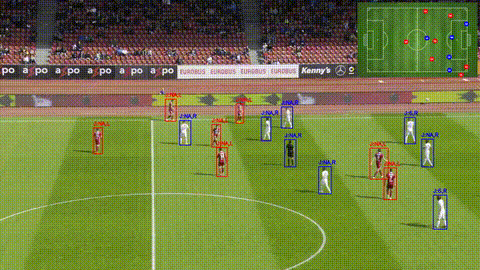
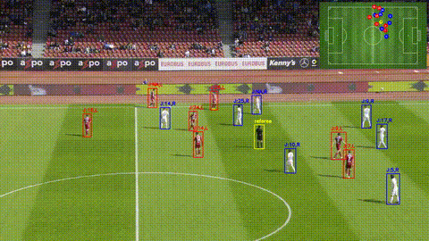

# Broadcast2Pitch: Game State Reconstruction from Unconstrained Soccer Videos (WACV 2026 Oral Presentation)

## 🏆 Winner of the SoccerNet Game State Reconstruction 2025 Challenge 🏆

| Baseline Model | Our Method |
| :---: | :---: |
|  |  |

**Affiliation:** Human Data Intelligence Lab, Korea Institute of Science and Technology (KIST), Seoul, Republic of Korea

This repository contains the official implementation for the SoccerNet Game State Reconstruction (GSR) task. It includes modules for camera calibration (homography estimation), player tracking, re-identification (ReID), role/jersey number recognition using CLIP and LLaMA models, and tracklet refinement.

> [!NOTE]
> The homography estimation (Sports Field Registration) approach in this repository follows our WACV paper approach, which differs slightly from the method described in [arXiv paper](https://arxiv.org/pdf/2508.19182).

## Installation

### Prerequisites
- Linux
- NVIDIA GPU + CUDA
- Python 3.12
- Conda

### Step-by-Step Installation

1.  **Create a Virtual Environment**
    ```bash
    conda create -n SoccernetGSR python=3.12
    conda activate SoccernetGSR
    ```

2.  **Install PyTorch**
    Install PyTorch compatible with your CUDA version. For example (CUDA 12.1):
    ```bash
    pip3 install torch torchvision torchaudio --index-url https://download.pytorch.org/whl/cu121
    ```

3.  **Install Dependencies**
    ```bash
    # Install build dependencies first
    pip install numpy cython

    # Install main requirements
    pip install -r requirements.txt
    ```
    
    *Note: Some packages might need to be installed from source with specific flags:*
    ```bash
    # Install CLIP from source
    pip install git+https://github.com/openai/CLIP.git

    # Install packages requiring numpy/cython during build
    pip install git+https://github.com/KaiyangZhou/deep-person-reid.git --no-build-isolation
    pip install 'git+https://github.com/cocodataset/cocoapi.git#subdirectory=PythonAPI' --no-build-isolation
    ```

4.  **Setup Project**
    ```bash
    python setup.py develop
    ```

## Data Preparation

Ensure your data is organized as follows:
```
data/
  SoccerNetGS/
    test/
    challenge/
```
Update `conf 4: Format Conversionigs/config.yaml` with the correct `DATA_DIR`.

## Usage

### Step 1: Download Weights
Download the required model weights from Google Drive.
```bash
python download_properties.py
```

### Step 2:  4: Format ConversionHomography Estimation
Run `kpts.py` to generate homography matrices (`.npy` files) for the video frames.
```bash
python kpts.py
```

### Step 3: Inference (Tracking & Recognition)
Run the main inference script to perform player tracking, ReID, and jersey number/role recognition.
You can choose between **CLIP** (faster) and **LLAMA** (more accurate) for jersey recognition by setting `JERSEY_MODE` in `configs/config.yaml`.

```bash
python inference_soccernetGSR.py
```

### Step 4: Tracking Results Post Processing using IDATR
Perform ID-Aware Tracklets Refinement (IDATR) using the initial tracklet results from step 3.
```bash
./refine_tracklets.sh
```

### Step 5: Format Conversion
Convert the inference results into the required JSON format for evaluation.
```bash
python write_json_file_team.py
```

### Step 6: Evaluation
Use the `sn-trackeval` toolkit to evaluate the results.
```bash
python ./sn-trackeval/scripts/run_soccernet_gs.py \
    --GT_FOLDER /path/to/SoccerNetGS \
    --TRACKERS_FOLDER /path/to/Pred_SN_GS2025/ \
    --TRACKER_SUB_FOLDER "" \
    --SPLIT_TO_EVAL "test"
```

### Step 7: Visualize Prediction Results
Run the script to visualize the generated JSON files:

```bash
python visualize_prediction_results.py --json_dir results/predicted_SNGamestate_results/test
```

## Models

Ensure you have the following checkpoints in the `checkpoints/` directory:
- YOLOX: `yolox_soccernet.pth.tar`
- ReID (OSNet): `sports_model.pth.tar-60`
- SFR (Keypoints): `SoccernetGSR_EfficientNet_Best.pth`
- CLIP Jersey Model: `CLIP_Jersey.pth`
- LLaMA Model: `lora_model_jersey_role_soccernet`

## Acknowledgements

This project builds upon:
- [SoccerNet](https://www.soccer-net.org/)
- [YOLOX](https://github.com/Megvii-BaseDetection/YOLOX)
- [DeepEIOU](https://github.com/hsiangwei0903/Deep-EIoU)
- [GTA](https://github.com/sjc042/gta-link)
- [Torchreid](https://github.com/KaiyangZhou/deep-person-reid)
- [CLIP](https://github.com/openai/CLIP)

## Contact

For inquiries about our work, please contact Jinwook Kim <jinwook.kim21@gmail.com>.